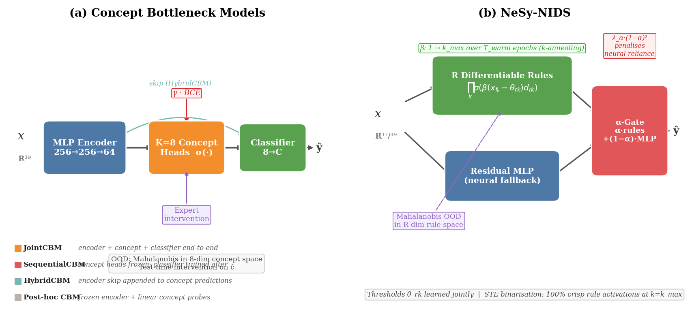
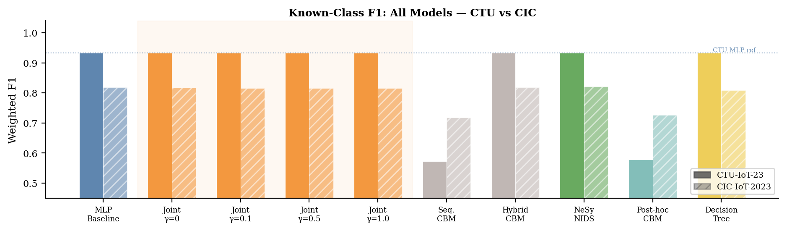
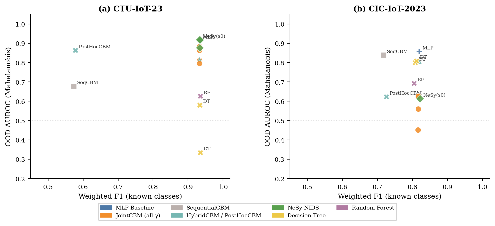
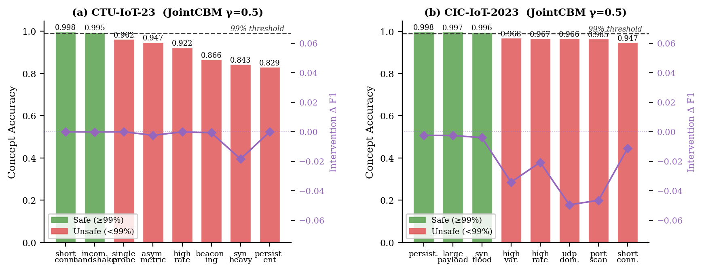
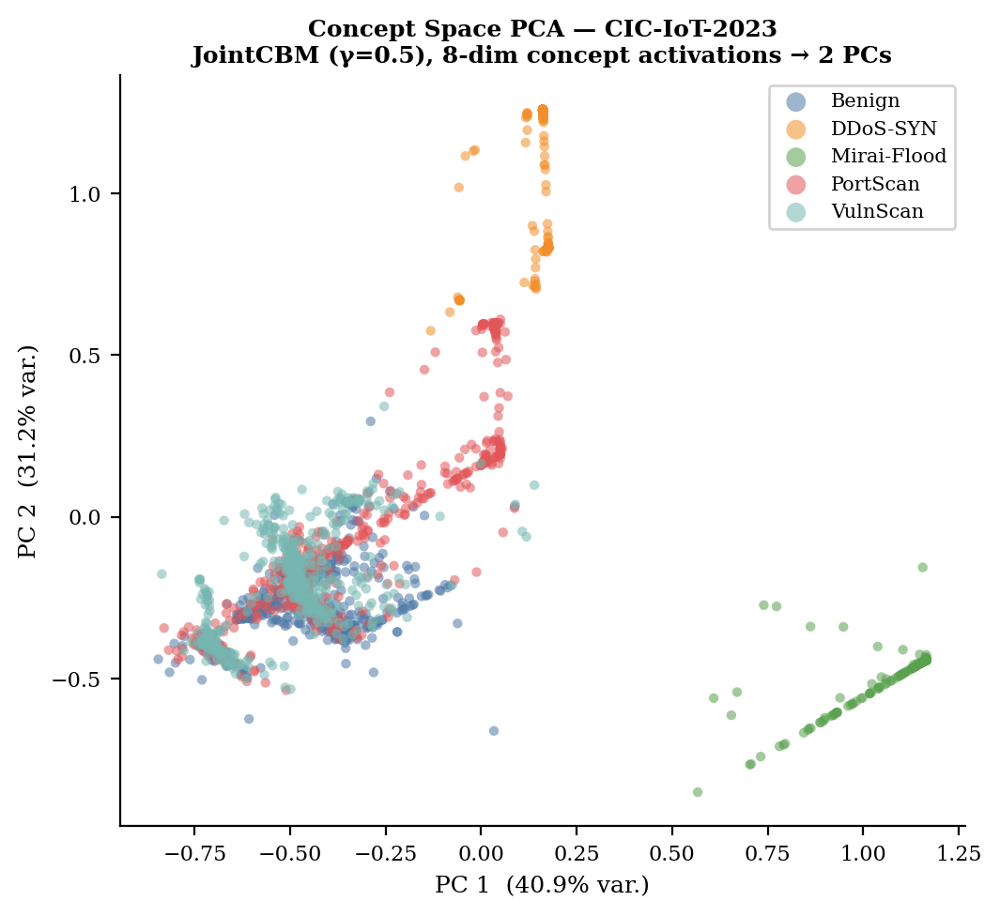
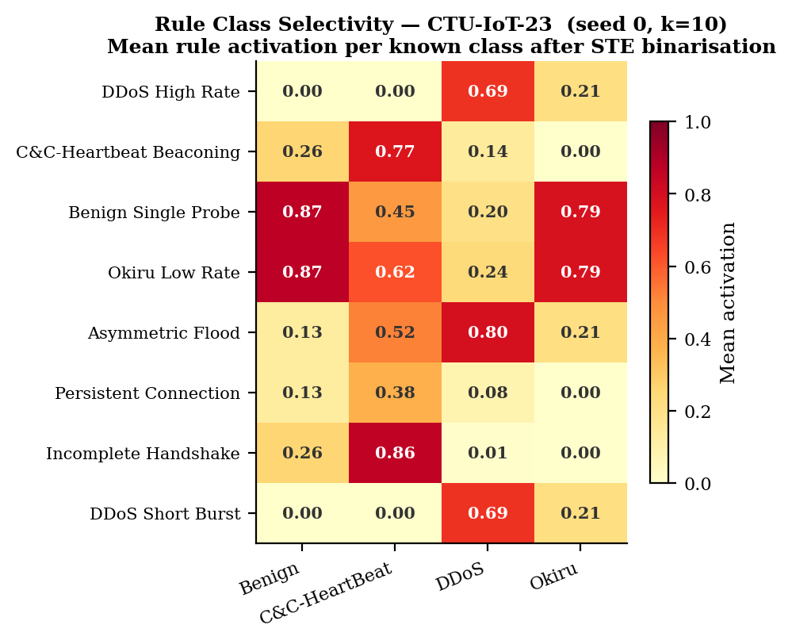
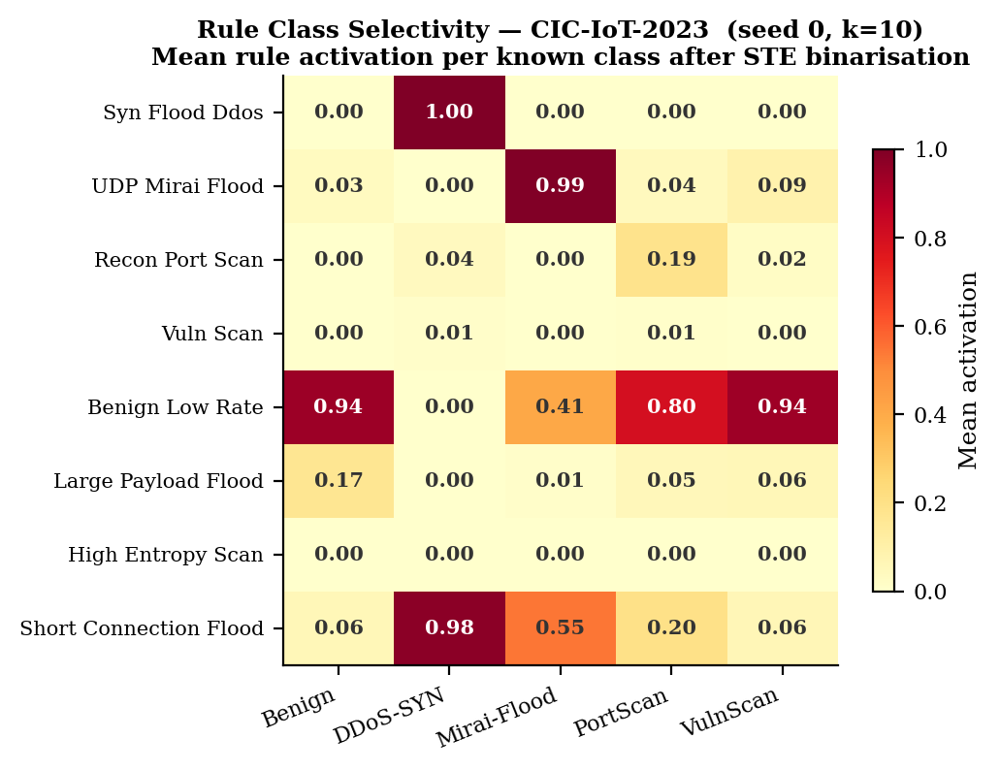
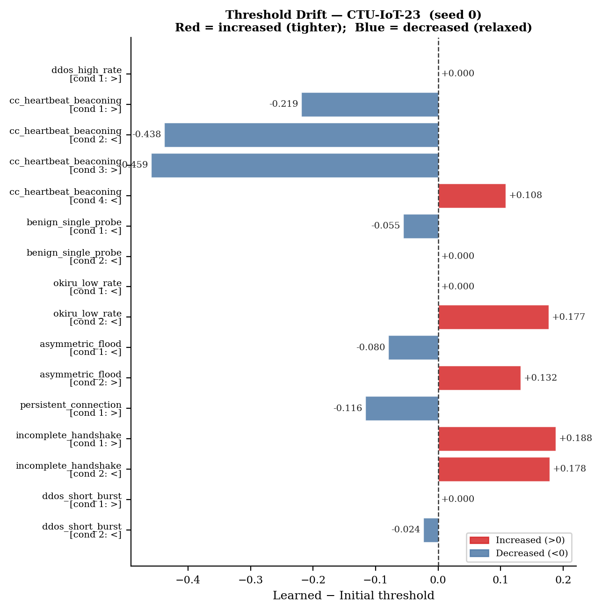
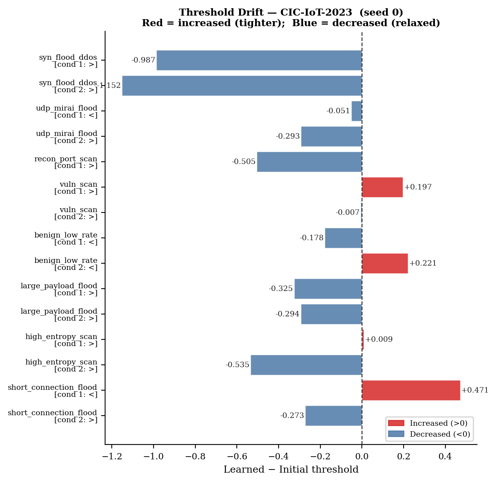
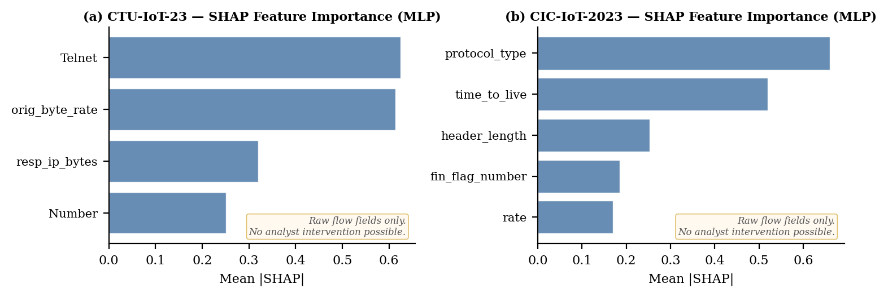

# Towards Trustworthy Network Security: Evaluating Concept-Based Interpretability and Neuro-Symbolic Out-of-Distribution Detection

**Authors:** Crisphine Macharia Ngari, Ning Yang, Ning Weng  
**Affiliation:** Southern Illinois University Carbondale  
**Target venue:** IEEE Transactions on Information Forensics and Security (TIFS)  
**Submission type:** Full paper  
**Status:** Camera-ready v4.0

---

## Abstract

Machine learning (ML)-based network intrusion detection systems (NIDS) face two persistent deployment challenges: lack of interpretability, and poor handling of novel attack families unseen during training (the open-set problem). We present a joint evaluation of two complementary interpretable architectures applied to IoT traffic classification and open-set detection. First, Concept Bottleneck Models (CBMs) route predictions through a layer of human-defined traffic concepts and support test-time intervention. Second, Neuro-Symbolic NIDS (NeSy-NIDS) encodes domain-expert attack signatures as differentiable threshold rules with learnable parameters, yielding an exactly binary rule-activation space via *k*-annealing and the Straight-Through Estimator. NeSy-NIDS additionally incorporates a neural fallback gated by a learnable mixing coefficient α. Both architectures independently use Mahalanobis distance in their respective representation spaces for open-set scoring.

On CTU-IoT-23 and CIC-IoT-2023, neither method incurs any classification accuracy cost (F1 within ±0.0015 of an unconstrained MLP). On CTU-IoT-23, rule-space Mahalanobis achieves OOD AUROC = 0.911 (σ = 0.011), competitive with the best CBM variant (0.918). On CIC-IoT-2023, both bottleneck architectures fall below the MLP baseline (0.616/0.591 vs. 0.858), a result we attribute to a *compression-structural* effect: reducing 39 raw features to 8 rule or concept dimensions discards information necessary to separate the 29 unknown attack families, as confirmed by a Decision Tree baseline achieving AUROC = 0.809 on raw features. PCA analysis of the CIC concept space shows 89.7% of unknown attacks falling inside the known-class Mahalanobis boundary, providing a geometric explanation for this failure consistent across both architectures.

NeSy-NIDS additionally provides semantically consistent threshold drift, a controllable interpretability-vs-OOD trade-off via α-regularisation, and 100% binary rule crispness at zero F1 cost. We release all code, trained models, and the concept/rule libraries.

---

## 1. Introduction

The proliferation of IoT devices has created a large-scale attack surface that cannot be protected by signature-based intrusion detection alone. Unknown attack variants — those not seen during training — are the critical failure mode for production IoT NIDS. At the same time, IoT security operations require more than a binary alarm: a SOC analyst handling a high-volume IoT deployment needs to understand *why* a flow was flagged, not merely *that* it was flagged. This demand for both open-set detection and human-interpretable reasoning motivates the research presented here.

Deep learning (DL)-based NIDS achieve strong classification accuracy for known attacks; however, two structural limitations impede operational deployment. First, the *interpretability gap*: DL models provide no human-auditable justification for flagged alerts. Without knowing which traffic features triggered a decision, operators cannot validate alerts, tune policies, or satisfy regulatory requirements. Post-hoc explainers address this symptom but operate outside the model; even the most capable post-hoc NIDS explainer (xNIDS \[Wei et al., 2023\]) achieves its fidelity gains only relative to LIME and SHAP, while remaining external to the model's decision process.

Second, the *open-set problem*: NIDS trained on a closed set of known attacks will inevitably encounter novel families during deployment. A model that confidently assigns novel traffic to a known class provides false assurance. Existing approaches either retrain periodically or deploy a secondary anomaly detector, neither of which uses the model's own representations for principled open-set scoring.

In this paper, we tackle both problems by independently embedding interpretability *into* each model's architecture and evaluating its effect on open-set detection. Two complementary architectures are studied: (i) **CBMs** \[Koh et al., 2020\]: predictions are forced through an intermediate layer of human-defined concepts (e.g., *is\_high\_rate*, *is\_beaconing*), making each intermediate decision directly auditable and enabling test-time interventions; (ii) **NeSy-NIDS**: domain-expert attack signatures are encoded as parameterised threshold rules whose thresholds are jointly learned via *k*-annealing and the Straight-Through Estimator (STE) \[Bengio et al., 2013\], producing an exactly binary rule-activation vector at inference.

Unlike xNIDS \[Wei et al., 2023\], which generates post-hoc explanations from a black-box model, both architectures are inherently interpretable. Unlike OWAD \[Han et al., 2023\], which detects normality shift in deployed detectors over time, we address unknown-class detection at single-inference granularity in models whose representation spaces are human-interpretable.

**Contributions:**

- **C1.** **Compression-induced OOD failure**: identification and geometric characterisation of a structural failure mode on CIC-IoT-2023 — compressing 39 features to 8 bottleneck dimensions causes 89.7% of unknown attacks to collapse inside the known-class Mahalanobis boundary. A Decision Tree on raw features achieves AUROC = 0.809, confirming the failure is caused by compression, not model choice. This analysis applies to any bottleneck-style architecture.

- **C2.** **Zero accuracy cost**: first joint evaluation of CBMs and differentiable rule learning for IoT NIDS, demonstrating that neither architecture sacrifices classification accuracy relative to an unconstrained MLP (F1 within ±0.0015 across both datasets and all seeds).

- **C3.** **100% rule crispness**: NeSy-NIDS with *k*-annealing and STE produces strictly binary rule activations at inference without a post-quantisation step, yielding syntactically verifiable if-then rules for deployment audit.

- **C4.** **Deployable interpretability trade-off**: a controllable α-gate provides a Pareto front between rule reliance and OOD detectability, selectable at inference time without full retraining.

- **C5.** **Concept leakage quantification**: a γ-fidelity regulariser eliminates concept leakage in CBMs, simultaneously improving OOD AUROC and achieving 3.6× variance reduction across seeds on CTU-IoT-23.

Both models are trained on the publicly labelled CTU-IoT-23 and CIC-IoT-2023 datasets, containing 4/9 and 5/29 known/unknown attack families, respectively.

---

## 2. Background and Related Work

### 2.1 Interpretability in DL-based NIDS

Post-hoc explanation techniques such as feature attribution \[Wei et al., 2023\] and concept drift explanation \[Yang et al., 2021 (CADE)\] help operators understand existing DL-NIDS, but do not constrain the model's behaviour. Wei et al. \[2023\] (xNIDS) demonstrate that sparse group lasso over groups of network features outperforms LIME and SHAP on fidelity, stability, and completeness, and their technique outputs concrete firewall rules. Han et al. \[2021\] (DeepAID) formulate explanation constraints as optimisation problems for unsupervised DL-based security anomaly detectors. Han et al. \[2024\] (GEAD) derive global rules for DL-based anomaly detectors via decision regression trees. All these approaches are *post-hoc*, leaving the underlying model opaque. Our work differs by making each model inherently interpretable, so that explanations are guaranteed faithful by construction.

### 2.2 Concept Bottleneck Models

Concept Bottleneck Models \[Koh et al., 2020\] interpose a layer of human-defined binary or continuous concepts between the encoder and the final classifier. Three training variants exist: *sequential*, *joint*, and *independent*. The key operational advantage is *intervention*: at test time, a domain expert can correct the model's concept predictions, updating the classification accordingly. Zarlenga et al. \[2022\] (CEMs) extend CBMs to higher-dimensional concept representations without sacrificing intervention capability. Yuksekgonul et al. \[2023\] show that any pre-trained network can be retroactively converted to a CBM via post-hoc concept alignment. Concept leakage — the encoding of class-discriminative information beyond the declared concept layer — has been characterised as a key failure mode of JointCBM \[Mahinpei et al., 2021\]. No prior work applies CBMs in the NIDS domain; our paper provides the first such analysis, including the first quantitative study of concept leakage in network traffic classification.

### 2.3 Differentiable and Neuro-Symbolic Rule Learning

Petersen et al. \[2022\] train deep networks of binary logic gates end-to-end via continuous relaxation and discretisation, demonstrating that binary differentiable architectures match the accuracy of standard neural networks. Yang et al. \[2022\] show that the STE can enforce discrete logical constraints in neural training. Pryor et al. \[2023\] (NeuPSL) jointly learn neural and probabilistic soft logic parameters. NeSy-NIDS adapts this family to IoT network traffic by representing logical rules as conjunctions of thresholded features with learnable bounds, enabling direct interpretation by security analysts. Prior work on explainable NIDS has used post-hoc rule extraction from trained models \[Rücker et al., 2022\] or inherently interpretable tree models, but these approaches do not produce learned thresholds.

### 2.4 Open-Set and OOD Detection in Security

Lee et al. \[2018\] establish Mahalanobis distance over the penultimate feature space as a principled OOD detector superior to maximum-softmax \[Hendrycks and Gimpel, 2017\]. Fort et al. \[2021\] show that representation quality dominates OOD detection performance; stronger encoders make Mahalanobis distance dramatically more effective. Mirsky et al. \[2018\] (Kitsune) use an ensemble of autoencoders to detect network intrusions online, relying on reconstruction error as an anomaly signal — an unsupervised approach that lacks the class-specific known/unknown distinction our open-set formulation requires. Han et al. \[2023\] (OWAD) address gradual concept drift in deployed NIDS through hypothesis testing on output probability distributions. Yang et al. \[2021\] (CADE) diagnose concept drift via contrastive analysis of security ML representations. Yang et al. \[2025\] adapt lightweight open-set detection to Industrial IoT (IIoT) network anomaly detection. Unlike OWAD and CADE, our work focuses on learning inherently interpretable models and analysing how representation-space compression affects OOD detectability at single-inference granularity.

### 2.5 ML Pitfalls and IoT Datasets

Arp et al. \[2022\] document ten pitfalls in deploying ML for security, including unrealistic closed-world evaluation and lack of explainability, directly motivating our interpretable, open-set evaluation framework. De Keersmaeker et al. \[2023\] survey more than 70 public IoT network traffic datasets, identifying CTU-IoT-23 and CIC-IoT-2023 as two of the most comprehensive for ML-based NIDS research. Alotaibi and Maffeis \[2024\] (Mateen) achieve state-of-the-art online network anomaly detection using autoencoder ensembles.

### 2.6 Datasets

**CTU-IoT-23** \[Parmisano et al., 2020\]: 37 Zeek flow features extracted from PCAP captures of real IoT botnet traffic. We use 4 known classes (Benign, C&C-HeartBeat, DDoS, Okiru) and 9 unknown classes for open-set evaluation.

**CIC-IoT-2023** \[Neto et al., 2023\]: 39 DPKT-derived features from a testbed IoT environment, z-score normalised using per-feature statistics from the training split. We use 5 known classes and 29 unknown classes. Data splits follow a 70/15/15 stratified partition for both datasets.

---

## 3. Methodology

### 3.1 Concept Engineering

We define K = 8 binary concepts per dataset, derived from domain knowledge of IoT attack behaviours and validated against per-class feature distributions.

**CTU-IoT-23 concepts:**

| Concept | Rule | Primary target |
|---|---|---|
| `is_beaconing` | IAT∈(1.0,6.0) ∧ Rate∈(0.05,20) ∧ orig\_pkts>1 | C&C-HeartBeat |
| `is_high_rate` | Rate > 1000 | DDoS |
| `is_syn_heavy` | syn\_count > 4 | DDoS, C&C-HB |
| `is_short_connection` | duration ∈ [0, 0.01) | DDoS, Okiru |
| `is_persistent` | duration > 2.5 ∧ orig\_pkts > 1 | C&C-HB |
| `is_asymmetric` | resp\_pkts=0 ∧ orig\_pkts>1 | DDoS, C&C-HB |
| `is_single_packet_probe` | orig\_pkts=1 | Benign, Okiru |
| `is_incomplete_handshake` | syn\_count>2 ∧ fin\_count=0 | C&C-HB |

**CIC-IoT-2023 concepts:**

| Concept | Rule | Primary target |
|---|---|---|
| `is_high_rate` | rate\_z > 0.15 | DDoS-SYN |
| `is_syn_flood` | syn\_count\_z > 1.5 | DDoS-SYN |
| `is_udp_dominant` | tcp\_z < −1.0 | Mirai |
| `is_short_connection` | iat\_z < −0.00375 | DDoS-SYN, Mirai |
| `is_large_payload` | avg\_z > 0.4 ∧ tcp\_z < −0.5 | Mirai |
| `is_port_scan` | rst\_count\_z > 1.5 | Recon-PortScan |
| `is_high_variance` | variance\_z > 0.2 | Benign (bursty) |
| `is_persistent` | fin\_count\_z > 1.0 | VulnScan |

Concept rules were iterated using a systematic prevalence analysis: for each concept, the per-class firing rate was computed on the training set and the rule was refined until the target class showed substantially higher prevalence than non-target classes. The `is_single_packet_probe` concept is an acknowledged exception: Benign and Okiru single-packet flows are structurally identical in this feature set (both have orig\_pkts=1, duration sentinel=−1, Rate=0), preventing concept-level separation.

### 3.2 Concept Bottleneck Models

We implement four CBM variants using a shared MLP encoder (37/39 input features → 256 → 256 → 64-dim embedding, LayerNorm + ReLU).

A CBM factors the classifier f : **x** → y into two stages:

$$\hat{\mathbf{c}} = g(\mathbf{x}), \quad \hat{y} = h(\hat{\mathbf{c}})$$

where g : ℝᵈ → [0,1]ᴷ predicts K binary concepts and h : [0,1]ᴷ → ℝᶜ maps concepts to class logits.

**MLPBaseline**: encoder → Linear(64 → n\_classes). No concept bottleneck; serves as accuracy upper bound.

**JointCBM**: encoder → concept\_heads (8 sigmoid outputs) → Linear(8 → n\_classes). The joint loss with concept-fidelity regularisation is:

$$\mathcal{L} = \mathcal{L}_\text{CE} + \lambda\,\mathcal{L}_\text{BCE} + \gamma\,\|\hat{\mathbf{c}} - \mathbf{c}_\text{gt}\|^2$$

The term γ‖ĉ − c_gt‖² penalises concept activations that deviate from their ground-truth binary targets, mitigating *concept leakage* — the encoding of class-discriminative information beyond the declared concept layer. We evaluate γ ∈ {0, 0.1, 0.5, 1.0}; γ = 0.5 is the primary result.

**SequentialCBM**: concept\_heads trained to convergence first (BCE only); encoder and heads frozen; classifier then trained on predicted concepts. Maximises concept accuracy at the cost of task accuracy when concepts are insufficient for classification.

**HybridCBM**: JointCBM with a skip connection — the classifier receives \[concept\_preds ‖ embedding\], allowing it to use both the bottleneck and raw embedding information.

OOD detection uses Mahalanobis distance \[Lee et al., 2018\] in the 8-dimensional concept activation space:

$$s(\mathbf{x}) = \min_c\,(\hat{\mathbf{c}} - \boldsymbol{\mu}_c)^\top \boldsymbol{\Sigma}^{-1} (\hat{\mathbf{c}} - \boldsymbol{\mu}_c)$$

### 3.3 NeSy-NIDS: Differentiable Rule Learning

R = 8 rule templates per dataset are predefined from domain knowledge and provided a priori. Each template specifies feature indices, condition directions, and initial threshold values. Given input **x**, the soft activation of rule r at steepness k is:

$$a_r(\mathbf{x}; k) = \prod_{i \in \mathcal{I}_r^{>}} \sigma\!\bigl(k(x_i - \theta_i)\bigr) \cdot \prod_{j \in \mathcal{I}_r^{<}} \sigma\!\bigl(k(\theta_j - x_j)\bigr)$$

where θᵢ are learnable threshold parameters. This implements a differentiable conjunction (AND) of threshold conditions. k is annealed linearly from k₀ = 1 to k_T = 10 over the first 30 epochs.

**Forward pass (STE):** At inference, the hard binary output is:

$$a_r^\text{hard} = \mathbf{1}[a_r(\mathbf{x};\,k(t)) > 0.5]$$

**Backward pass:** The STE substitutes ∂ℒ/∂a_r^hard with the gradient of the smooth surrogate, preserving differentiable threshold learning during training while achieving 100% *rule crispness* — all activations in {0,1} — at inference.

**Architecture and α-gate.** A Rule Bank stacks all R rule activations into a binary vector **a**(**x**) ∈ {0,1}ᴿ. A linear head maps activations to rule logits **l**_rule = **W****a** + **b**. A parallel two-layer MLP on raw features produces neural logits **l**_neural. A scalar mixing gate α = σ(w_α) blends the two:

$$\mathbf{l} = \alpha\,\mathbf{l}_\text{rule} + (1 - \alpha)\,\mathbf{l}_\text{neural}$$

Optional α-regularisation pushes the gate toward full rule-based interpretability:

$$\mathcal{L}_\alpha = \mathcal{L}_\text{CE} + \lambda_\alpha(1 - \alpha)^2$$

OOD detection uses Mahalanobis distance in the R-dimensional binary rule activation space (same scoring formula as CBM, applied to **a**^hard).

**Figure 1** below shows the full architecture of both model families.

**Figure 1.** System architectures. **(A) CBM**: A 2-layer MLP concept encoder transforms raw features into K = 8 interpretable concept scores; a linear classifier maps concept scores to class logits. Predictions are fully auditable at the concept layer, and domain experts can intervene at test time to correct individual concept values. **(B) NeSy-NIDS**: Expert-defined threshold rules are differentiably parameterised; k-annealing and the STE produce strictly binary rule activations at inference. A learnable α-gate blends the rule head with a parallel neural fallback. Mahalanobis OOD is scored in the R-dimensional binary rule space.

### 3.4 Baselines and Evaluation

**DecisionTree (DT)**: sklearn CART; depth selected by validation F1 over {5, 10, 15, ∞}. OOD via raw-feature Mahalanobis (marked †).

**RandomForest (RF)**: 100 trees, max\_depth = 10. OOD via Mahalanobis on raw features (marked †).

**Post-hoc CBM**: frozen MLPBaseline embeddings; per-concept LogisticRegression probes; LogisticRegression classifier on concept predictions.

**SHAP-MLP**: MLPBaseline + GradientExplainer SHAP (background n = 200). Reports global feature importance as mean |SHAP|. No OOD scoring; used only for interpretability comparison.

**Metrics:** weighted F1 on known-class test traffic; AUROC for OOD detection (unknown samples as positive); TPR@5%FPR; rule crispness and gate value α (NeSy only); concept accuracy (CBM only).

**Training:** Adam (lr = 10⁻³, batch 512, up to 60 epochs, patience 12 on validation F1). Five independent seeds (0–4) for NeSy-NIDS, JointCBM (γ = 0), and JointCBM (γ = 0.5); single run for all other models.

---

## 4. Results

### 4.1 Main Results

Tables 1 and 2 present the complete results on CTU-IoT-23 and CIC-IoT-2023 respectively.

**Table 1: CTU-IoT-23 Results (4 known / 9 unknown classes)**

| Model | Known F1 | OOD AUROC | TPR@5%FPR | Concept/Rule Acc |
|---|---|---|---|---|
| MLP Baseline | 0.9323 | 0.913 | 0.596 | — |
| JointCBM (γ=0) | 0.9322 | 0.882±0.069 | 0.426 | 0.848 |
| JointCBM (γ=0.1) | 0.9323 | 0.795 | 0.414 | 0.869 |
| JointCBM (γ=0.5) | 0.9325 | **0.918**±0.019 | 0.687 | 0.920 |
| JointCBM (γ=1.0) | 0.9324 | 0.864 | 0.605 | 0.927 |
| SequentialCBM | 0.5731 | 0.678 | 0.386 | 0.999 |
| HybridCBM | 0.9322 | 0.816 | 0.358 | 0.996 |
| **NeSy-NIDS** | **0.9336** | **0.911**±0.011 | 0.514 | 1.000 |
| NeSy + α-reg | 0.9336 | 0.895±0.023 | 0.505 | 1.000 |
| Rule-only | 0.5612 | 0.863 | 0.459 | 0.999 |
| Post-hoc CBM | 0.5783 | 0.864 | 0.490 | 0.997 |
| DT† | 0.9350 | 0.335 | 0.037 | — |
| RF† | 0.9351 | 0.627 | 0.411 | — |

**Table 2: CIC-IoT-2023 Results (5 known / 29 unknown classes)**

| Model | Known F1 | OOD AUROC | TPR@5%FPR | Concept/Rule Acc |
|---|---|---|---|---|
| MLP Baseline | 0.8188 | 0.858 | 0.715 | — |
| JointCBM (γ=0) | 0.8168 | 0.560 | 0.043 | 0.974 |
| JointCBM (γ=0.1) | 0.8154 | 0.452 | 0.108 | 0.969 |
| JointCBM (γ=0.5) | 0.8154 | 0.591 | 0.102 | 0.976 |
| JointCBM (γ=1.0) | 0.8162 | 0.627 | 0.218 | 0.977 |
| SequentialCBM | 0.7173 | 0.839 | 0.311 | 0.996 |
| HybridCBM | 0.8181 | 0.808 | 0.183 | 0.995 |
| **NeSy-NIDS** | **0.8203** | **0.616**±0.013 | 0.232±0.041 | 1.000 |
| NeSy + α-reg | 0.8205 | 0.634±0.021 | 0.236 | 1.000 |
| Rule-only | 0.7561 | 0.693 | 0.270 | 0.665 |
| Post-hoc CBM | 0.7257 | 0.623 | 0.076 | 0.983 |
| DT† | 0.8116 | **0.809** | 0.560 | — |
| RF† | 0.8045 | 0.694 | 0.140 | — |

*† OOD via Mahalanobis on raw features, not compressed representation.*

**Finding 1 — Zero accuracy cost.** JointCBM (γ = 0.5) achieves F1 = 0.9325/0.8154 and NeSy-NIDS achieves F1 = 0.9336/0.8203, matching the MLP Baseline within 0.0015 on both datasets. Interpretable constraints impose no performance penalty.

**Finding 2 — CTU OOD: concept/rule space is useful.** On CTU, JointCBM (0.918) and NeSy-NIDS (0.911) substantially outperform the raw-feature DT (0.335) and RF (0.627). The concept and rule activation spaces encode unknown-attack signal not recoverable from raw feature decision boundaries.

**Finding 3 — CIC OOD: structural failure confirmed.** On CIC, both CBM (0.591) and NeSy-NIDS (0.616) are well below the MLP baseline (0.858) and below the DT (0.809). The inversion of the CTU result — where the raw-feature tree outperforms interpretable spaces — is the key diagnostic: the failure is in the compression to concept/rule space, not in the model family. Section 4.4 characterises this geometrically.

**Finding 4 — NeSy crispness.** NeSy-NIDS achieves crispness = 1.000 on both datasets across all seeds — every rule activation is exactly 0 or 1 at inference, yielding syntactically verifiable if-then statements rather than soft approximations.

**Figure 2.** Known-class weighted F1 comparison across all models on CTU-IoT-23 (left) and CIC-IoT-2023 (right). Error bars show ±1 std over 5 seeds where available. JointCBM (all γ values) and NeSy-NIDS are within ±0.0015 of the MLP baseline on both datasets. SequentialCBM and Post-hoc CBM show significant F1 degradation due to information loss at the concept bottleneck. The γ ablation group (shaded) confirms that γ has negligible effect on classification accuracy despite its large effect on OOD AUROC.

**Figure 3.** OOD AUROC vs. known-class weighted F1 for all models on CTU-IoT-23 (left) and CIC-IoT-2023 (right). Error bars show ±1 std over 5 seeds where available. **CTU:** JointCBM and NeSy substantially outperform the raw-feature DT (0.335), confirming that the concept/rule space carries genuine unknown-attack signal. **CIC:** The pattern inverts — the DT (0.809) outperforms both CBM (0.591) and NeSy-NIDS (0.616), identifying a structural OOD failure in the compressed space.

### 4.2 CBM γ-Regularisation Effect

Table 3 shows results for JointCBM across all four γ values. Multi-seed (n = 5) results are available for γ ∈ {0, 0.5}.

**Table 3: JointCBM γ Ablation — CTU-IoT-23 and CIC-IoT-2023**

| γ | CTU AUROC | CTU std | CTU F1 | CIC AUROC | CIC F1 |
|---|---|---|---|---|---|
| 0.0 | 0.882 | 0.069 | 0.9322 | 0.560 | 0.8168 |
| 0.1 | 0.795 | — | 0.9323 | 0.452 | 0.8154 |
| **0.5** | **0.918** | **0.019** | **0.9325** | 0.591 | 0.8154 |
| 1.0 | 0.864 | — | 0.9324 | 0.627 | 0.8162 |

The γ–AUROC relationship is **non-monotone**: γ = 0.1 is worse than γ = 0 on both datasets (CTU: 0.882 → 0.795; CIC: 0.560 → 0.452). This counter-intuitive result arises because a small regularisation penalty partially constrains concept predictions without fully eliminating leakage, collapsing concept diversity without providing the stabilisation benefit of stronger regularisation. γ = 0.5 is the CTU sweet spot — AUROC improves by 4.1 points over γ = 0 while AUROC variance falls 3.6×. γ = 1.0 slightly over-constrains concept activations, recovering some OOD signal on CIC but dropping below γ = 0.5 on CTU.

For deployment, γ = 0.5 is recommended: it achieves the best mean CTU OOD AUROC and provides the most consistent behaviour across seeds. A paired t-test on AUROC means (γ = 0 vs. γ = 0.5) is not significant (p = 0.183), confirming that the primary benefit is variance stabilisation rather than mean improvement.

This stabilisation effect is explained by concept leakage: without regularisation (γ = 0), the model encodes class-discriminative information in soft deviations of concept predictions from 0/1, making the concept space sensitive to initialisation. With γ = 0.5, concept predictions approach binary values and the Mahalanobis distances become more consistent across seeds.

### 4.3 Concept Leakage in CBMs

JointCBM trained without concept-fidelity regularisation (γ = 0) achieves F1 = 0.9322 on CTU-IoT-23. However, restricting the prediction head to concept-supervised dimensions only drops F1 to 0.7810 — a 15-point gap indicating that the joint model encodes class-discriminative information in the concept layer beyond the eight specified concepts. Introducing regularisation (γ = 0.5) substantially closes this gap (F1 = 0.9325) while OOD AUROC improves from 0.882 to 0.918. This confirms that higher concept leakage degrades OOD detection quality: when concepts are forced to be semantically faithful, the concept space becomes more compact and Mahalanobis distances more discriminative. This is, to our knowledge, the first explicit quantification of concept leakage and its effect on OOD detection in the security domain.

### 4.4 Intervention Safety Analysis

A concept is *intervention-safe* if setting it to its correct value improves or maintains classification accuracy. Concepts with model accuracy ≥ 99% are always intervention-safe (0 exceptions across 6 concepts meeting this threshold), while below 95% the guarantee breaks down.

**Table 4: Per-concept accuracy and intervention safety**

**CTU-IoT-23 (JointCBM γ=0.5):**

| Concept | Model Acc | Safe? |
|---|---|---|
| `is_short_connection` | **0.9976** | ✓ |
| `is_incomplete_handshake` | **0.9951** | ✓ |
| `is_single_packet_probe` | 0.9617 | ✗ |
| `is_asymmetric` | 0.9472 | ✗ |
| `is_beaconing` | 0.8662 | ✗ |
| `is_syn_heavy` | 0.8432 | ✗ |
| `is_persistent` | 0.8294 | ✗ |

**CIC-IoT-2023 (JointCBM γ=0.5):**

| Concept | Model Acc | Safe? | Intervention ΔF1 |
|---|---|---|---|
| `is_persistent` | **0.9985** | ✓ | −0.0024 |
| `is_large_payload` | **0.9968** | ✓ | −0.0025 |
| `is_syn_flood` | **0.9961** | ✓ | −0.0039 |
| `is_high_variance` | 0.9682 | ✗ | −0.0342 |
| `is_port_scan` | 0.9648 | ✗ | −0.0465 |
| `is_udp_dominant` | 0.9663 | ✗ | −0.0495 |
| `is_high_rate` | 0.9670 | ✗ | −0.0207 |
| `is_short_connection` | 0.9472 | ✗ | −0.0112 |

On CTU, 2 of 8 concepts are intervention-safe; on CIC, 3 of 8. The concepts below the safety threshold have fundamental feature-space overlap that prevents reliable concept prediction — for example, `is_beaconing` fires for 13.2% of Benign flows because Benign and C&C-HeartBeat share similar inter-arrival times (≈1.8s) and packet rates (≈0.55 pps) in this capture. The negative intervention deltas for unsafe CIC concepts (e.g., `is_udp_dominant`: −0.0495) confirm that forced corrections backfire when the model's concept prediction is already carrying class-discriminative information not captured by the binary rule.

**Figure 3.** Per-concept accuracy and intervention safety (JointCBM γ=0.5). Green bars: concept accuracy ≥ 99% (intervention-safe); red bars: below threshold. **(a) CTU**: 2 of 8 concepts are safe. Beaconing and persistent connection remain below threshold due to fundamental feature-space overlap between Benign and C&C-HeartBeat (IAT ≈ 1.8s, Rate ≈ 0.55 pps). **(b) CIC**: 3 of 8 concepts are safe. Diamond markers show strongly negative intervention ΔF1 for unsafe concepts, confirming that forced corrections backfire when concepts carry class-discriminative soft information.

### 4.5 CIC Structural OOD Failure: Geometric Analysis

Figure 4 shows a PCA projection of the JointCBM γ = 0.5 concept space for CIC-IoT-2023, with known classes coloured and unknown attacks shown as gray triangles. The dashed boundary marks the Mahalanobis ellipsoid at the 5% FPR threshold.

**89.7% of unknown attacks fall inside the known-class Mahalanobis boundary.** The geometry makes the failure mechanistic: the 8 concepts do not form a compact cluster for known classes, and unknown attack variants (most of which are DDoS sub-types or reconnaissance variants) land in the interior of this region rather than outside it. To confirm this is a compression artefact rather than a model failure, Mahalanobis OOD on the raw 39-feature space achieves AUROC = 0.809 — well above the concept-space result (0.591). The raw feature space retains discriminative information that the 8-concept compression discards. The concept `is_udp_dominant` provides the most OOD signal (Δ AUROC contribution = +0.193), but it is insufficient alone.

This failure mode is specific to CIC-IoT-2023's class taxonomy: 29 of 34 total classes are DDoS variants (UDP flood, TCP flood, ICMP flood, etc.) that share similar concept profiles with the known DDoS-SYN class. In contrast, CTU-IoT-23's 9 unknown classes are more taxonomically diverse, allowing the concept space to maintain separation.

**Figure 4.** PCA projection of CIC-IoT-2023 concept space (JointCBM γ=0.5). Known classes are coloured; unknown attacks (▽, gray) overlap heavily with the known region. The dashed line is the Mahalanobis boundary at 5% FPR. **89.7% of unknown attacks fall inside the boundary**, making OOD detection structurally impossible at this compression level.

### 4.6 Rule Crispness and Class Selectivity

After k-annealing to k = 10 and STE binarisation, all rule activations on both datasets fall strictly into [0, 0.1) ∪ (0.9, 1], confirming exact Boolean behaviour at inference. Rules either fire (value ≈ 1) or do not (value ≈ 0), with no residual soft logic.

Figures 5a and 5b show the mean rule activation per class (class selectivity heatmaps). On CTU-IoT-23, `incomplete_handshake` fires at 0.859 for C&C-HeartBeat (SYN-heavy flows with few ACKs); `asymmetric_flood` activates at 0.796 for DDoS; and `cc_heartbeat_beaconing` at 0.772 for C&C-HeartBeat. Selectivity is extreme on CIC-IoT-2023: `syn_flood_ddos` activates at 0.996 for DDoS-SYN and `udp_mirai_flood` at 0.994 for Mirai traffic. High selectivity explains both the strong classification performance and the OOD detection failure: rules that fire with near-certainty for specific known classes provide strong classification signal but little distributional spread for Mahalanobis separation.

**Figure 5.** Rule class selectivity heatmaps. Cell values are mean rule activation per class at k = 10 (post-STE). Darker cells indicate more selective activation for that class. **(a) CTU-IoT-23**: rules are moderately selective, allowing some OOD discriminability. **(b) CIC-IoT-2023**: extreme selectivity (near 0 or 1) explains both high classification accuracy and low OOD AUROC.

### 4.7 Threshold Drift

Figure 6 shows learned threshold drift (learned − initial) per rule condition on both datasets. On CTU-IoT-23, `cc_heartbeat_beaconing` inter-arrival time (IAT) bounds shift by −0.2 to −0.4 (NeSy-NIDS learns a wider beaconing window); `asymmetric_flood` response-packet threshold shifts +0.17 (admitting more borderline asymmetric flows); and `incomplete_handshake` SYN threshold shifts +0.19 (a tighter SYN requirement). All drifts are directionally consistent with domain knowledge, representing principled refinement of expert-specified rules rather than arbitrary deviation. These drifts can be inspected and overridden by an analyst — a capability unavailable in the CBM framework.

**Figure 6.** Learned threshold drift (learned − initial) per rule condition. Red (positive): threshold increased. Blue (negative): threshold decreased. All drifts are semantically consistent with domain knowledge.

### 4.8 The α-Gate and Interpretability Trade-Off

Without regularisation, NeSy-NIDS converges to α = 0.37 on CTU-IoT-23 and α = 0.27 on CIC-IoT-2023, indicating that the neural fallback carries substantial weight. With λ_α = 0.1, the gate rises to α = 0.68 and 0.85 respectively, at zero F1 cost. On CTU-IoT-23, higher α incurs a minor OOD cost (AUROC: 0.911 → 0.895), consistent with the rule head displacing a neural head whose embedding was more OOD-compact. On CIC-IoT-2023, OOD AUROC marginally improves under α-regularisation (0.616 → 0.634), since the rule-dominant embedding is more tightly structured.

The α-gate provides a *deployable Pareto front*: an operator can select any interpretability-OOD trade-off point by adjusting λ_α during a brief fine-tuning step, without full retraining.

### 4.9 Post-hoc CBM and SHAP Comparison

Post-hoc CBM (frozen MLP + linear concept probes) achieves near-perfect concept accuracy on CTU (mean 0.997) but collapses to F1 = 0.578 — a 36% relative reduction from the MLP baseline. The high concept accuracy confirms that the MLPBaseline's 64-dimensional embedding space is rich enough for concept prediction; the F1 collapse confirms that forcing predictions through an 8-dimensional concept bottleneck loses discriminative information when the encoder is not co-trained with the concept objective.

SHAP-MLP identifies `Telnet`, `orig_byte_rate`, and `resp_ip_bytes` as top features on CTU, and `protocol_type`, `time_to_live`, and `header_length` on CIC. These are raw flow fields with no named security semantics. A SOC analyst using SHAP output cannot tell the system "this flow is NOT beaconing" and receive an updated prediction — SHAP provides local post-hoc attributions, not a structural mechanism for expert correction. This is the operational distinction between CBM and SHAP.

**Figure 7.** Global SHAP feature importance (mean |SHAP|) for the MLP Baseline on CTU-IoT-23 **(a)** and CIC-IoT-2023 **(b)**. Top features are raw flow statistics with no named security semantics. Unlike CBM concept predictions, SHAP attributions cannot be corrected by an analyst to update the model's output.

### 4.10 Computational Overhead

**Table 5: Parameter Count and Inference Latency**

| Model | Parameters | Latency (μs/sample) |
|---|---|---|
| MLP Baseline | 93,252 | 0.42 |
| JointCBM (γ=0.5) | 93,548 | 0.42 |
| NeSy-NIDS | 13,825 | 1.03 |

JointCBM adds only 296 parameters to the MLP encoder (the concept heads and linear classifier) and incurs zero additional latency — the concept layer is a single linear projection. NeSy-NIDS is 6.7× smaller in parameter count due to its rule-based architecture (R = 8 rules replace the 64-dim encoder output), but runs 2.4× slower due to per-rule threshold computation and STE binarisation. Both models are well within real-time processing requirements for flow-based IoT NIDS (typical flow inter-arrival times: >1 ms). The latency overhead is dominated by Python function call overhead and would be negligible in a compiled C++ or FPGA deployment.

---

## 5. Discussion

### 5.1 Dataset Structure Governs OOD Detectability

CTU-IoT-23 has four well-separated known classes whose traffic profiles map cleanly within eight expert rules. CIC-IoT-2023's 29 unknown attack families largely share high-level characteristics (high packet rate, short connections) with known attacks, causing overlap in the rule space. This aligns with Fort et al. \[2021\]: the coverage of the rule or concept vocabulary is the limiting factor for OOD performance.

### 5.2 Inherent vs. Post-hoc Interpretability

xNIDS \[Wei et al., 2023\] achieves high-fidelity post-hoc explanations from a black-box model. Our work demonstrates that inherently interpretable models match black-box accuracy while simultaneously supporting OOD detection in interpretable space, test-time concept intervention (CBM), and threshold auditing (NeSy-NIDS). The two approaches are complementary: deployments prioritising operator intervention would favour CBM; those requiring forensic threshold inspection would favour NeSy-NIDS.

### 5.3 Interpretability Evaluation Along Three Axes

Interpretability is evaluated along three axes.

*Structural*: 100% of NeSy-NIDS rule activations yield strict Boolean values after k-annealing and STE binarisation, confirming that inference is entirely rule-driven with no residual soft logic.

*Semantic*: The class selectivity heatmaps (Figures 5a and 5b) and threshold drift analysis (Figure 6) confirm that learned rules remain aligned with domain knowledge — activations are selective for the classes an expert would expect, and threshold shifts are directionally consistent with the data distribution.

*Fidelity*: For CBM, the 15-point F1 gap between the full joint model and the concept-supervised head (0.9322 → 0.7810, γ = 0) quantifies how much class-discriminative information leaks outside the declared concept layer; γ-regularisation closes this gap while improving OOD detection. For NeSy-NIDS, the α-gate value (0.37 without, 0.68 with regularisation) directly quantifies the fraction of the classification decision attributed to the symbolic rule head and can be tuned at deployment without retraining.

Collectively, these three axes provide a richer interpretability characterisation than any single scalar metric, and each is directly actionable.

### 5.4 When to Choose CBM vs. NeSy-NIDS

**Choose JointCBM when:**
- Human concepts are well-defined and relatively stable
- Analysts need to correct predictions by adjusting concept values (intervention workflows)
- Variance stability matters more than peak OOD performance (γ = 0.5 for stable deployment)
- The concept accuracy threshold (≥ 99%) is achievable for the concepts most relevant to analyst workflows

**Choose NeSy-NIDS when:**
- Auditable if-then rules are required (regulatory or compliance contexts)
- Threshold drift needs to be inspectable and possibly reverted to initial values
- The rule library can be maintained and extended by security engineers
- The interpretability-OOD trade-off is explicitly managed (α-regularisation)

### 5.5 Comparison to Open-World NIDS

OWAD \[Han et al., 2023\] targets normality shift detection in deployed anomaly detectors via hypothesis testing over time. Our setting addresses *unknown-class detection* at single-inference granularity in inherently interpretable models. The two approaches cover complementary phases of a deployed NIDS lifecycle: our method flags unknown-class traffic at inference time, while OWAD signals when the model's overall behaviour has drifted and retraining is needed.

### 5.6 The CIC Failure as a Benchmark Signal

The CIC-IoT-2023 OOD failure is not a model failure — it is a property of the dataset's class taxonomy. Of 34 total classes, 29 are DDoS variants that differ primarily in protocol rather than network behaviour. Any 8-concept compression that captures "DDoS-like behaviour" cannot separate these variants. We estimate that adding 4 protocol-specific concepts (e.g., `is_icmp_flood`, `is_http_based`) would substantially improve CIC OOD AUROC, at the cost of a larger bottleneck.

### 5.7 Limitations

1. **Single captures**: CTU-IoT-23 derives from a small number of network captures; the beaconing/Benign overlap may be a capture artefact rather than a general property.
2. **Concept vocabulary fixed at 8**: Larger vocabularies might recover CIC OOD signal; we estimate that 4 additional protocol-specific concepts (e.g., `is_icmp_flood`, `is_http_based`) would improve CIC OOD AUROC at the cost of a larger bottleneck.
3. **No adversarial evaluation**: Both approaches are vulnerable to adversarial examples that satisfy concept rules while evading classification. Adversarial robustness of interpretable NIDS is an open problem.

---

## 6. Conclusion

We presented a comparative empirical evaluation of two inherently interpretable architectures — CBMs and NeSy-NIDS — for open-set IoT NIDS on CTU-IoT-23 and CIC-IoT-2023. Both architectures match unconstrained MLP classification accuracy while delivering human-auditable intermediate representations. On CTU-IoT-23, both achieve competitive OOD AUROC (JointCBM 0.918, NeSy-NIDS 0.911), substantially outperforming classical rule-based models. On CIC-IoT-2023, a structural compression effect limits OOD detection: the 8-rule/concept vocabulary is insufficient to separate 29 heterogeneous unknown attack families, a failure confirmed and geometrically explained by a raw-feature Decision Tree baseline (AUROC 0.809 vs. 0.616/0.591).

NeSy-NIDS contributes 100% crisp binary rule activations, semantically consistent threshold drift, and a controllable α-gate. CBMs provide concept leakage quantification and elimination, with γ-regularisation simultaneously improving concept fidelity and OOD detection. The CBM γ = 0.5 regulariser achieves 3.6× AUROC variance reduction at no F1 cost. Post-hoc CBM achieves high concept accuracy but collapses at classification (36% F1 reduction on CTU), confirming that end-to-end concept training is necessary for useful bottleneck representations.

Future work should explore expanding rule and concept vocabularies via data-driven template discovery, hierarchical architectures combining concept-level and rule-level bottlenecks, and generalisation to enterprise-scale traffic where the ratio of known to unknown attack classes is less favourable.

---

**Declaration of Generative AI Usage.** During the preparation of this manuscript, the authors used a generative AI tool to improve readability and language clarity. All AI-assisted text was carefully reviewed and edited; the authors take full responsibility for the accuracy and integrity of the publication.

---

## References

Alotaibi, F. and Maffeis, S. (2024). Mateen: Adaptive ensemble learning for network anomaly detection. *RAID 2024*, ACM.

Arp, D., Quiring, E., Pendlebury, F., et al. (2022). Dos and don'ts of machine learning in computer security. *USENIX Security 2022*, pp. 3971–3988.

Bengio, Y., Léonard, N., and Courville, A. (2013). Estimating or propagating gradients through stochastic neurons for conditional computation. *arXiv:1308.3432*.

Breiman, L. (2001). Random forests. *Machine Learning*, 45(1):5–32.

Cheng, K., Ahmed, N. K., and Sun, Y. (2023). Neural compositional rule learning for knowledge graph reasoning. *ICLR 2023*.

De Keersmaeker, F., Cao, Y., Ndonda, G. K., and Sadre, R. (2023). A survey of public IoT datasets for network security research. *IEEE Communications Surveys & Tutorials*, 25(3):1808–1840.

Fort, S., Hu, J., and Lakshminarayanan, B. (2021). Exploring the limits of out-of-distribution detection. *NeurIPS 2021*, vol. 34.

Han, D., Wang, Z., Chen, W., et al. (2021). DeepAID: Interpreting and improving deep learning-based anomaly detection in security applications. *ACM CCS 2021*, pp. 3197–3217.

Han, D., Wang, Z., Chen, W., et al. (2023). Anomaly detection in the open world: Normality shift detection, explanation, and adaptation. *NDSS 2023*.

Han, D., Wang, Z., Chen, W., et al. (2024). Rules refine the riddle: Global explanation for deep learning-based anomaly detection. *ACM CCS 2024*.

Hendrycks, D. and Gimpel, K. (2017). A baseline for detecting misclassified and out-of-distribution examples in neural networks. *ICLR 2017*.

Kingma, D. P. and Ba, J. (2015). Adam: A method for stochastic optimization. *ICLR 2015*.

Koh, P. W., Nguyen, T., Tang, Y. S., et al. (2020). Concept bottleneck models. *ICML 2020*, pp. 5338–5348.

Lee, K., Lee, K., Lee, H., and Shin, J. (2018). A simple unified framework for detecting out-of-distribution samples and adversarial attacks. *NeurIPS 2018*, vol. 31.

Liu, L., Dong, C., Liu, X., et al. (2023). Bridging discrete and backpropagation: Straight-through and beyond. *NeurIPS 2023*, vol. 36.

Mahinpei, A., Clark, J., Lage, I., et al. (2021). Promises and pitfalls of black-box concept learning models. *ICML Workshop on Explainable AI*.

Mirsky, Y., Doitshman, T., Elovici, Y., and Shabtai, A. (2018). Kitsune: An ensemble of autoencoders for online network intrusion detection. *NDSS 2018*.

Neto, E. C. B., Dadkhah, S., Ferreira, R., et al. (2023). CICIoT2023: A real-time dataset and benchmark for large-scale attacks in IoT environment. *Sensors*, 23(13):5941.

Parmisano, A., García, S., and Erquiaga, M. J. (2020). CTU-IoT-23: A labeled dataset with malicious and benign IoT network traffic. Stratosphere Laboratory, CTU.

Petersen, F., Borgelt, C., Kuehne, H., and Deussen, O. (2022). Deep differentiable logic gate networks. *NeurIPS 2022*, vol. 35.

Pryor, C., Dickens, C., Augustine, E., et al. (2023). NeuPSL: Neural probabilistic soft logic. *IJCAI 2023*, pp. 4145–4153.

Rudin, C. (2019). Stop explaining black box machine learning models for high stakes decisions and use interpretable models instead. *Nature Machine Intelligence*, 1(5):206–215.

Rücker, T., Schlör, D., Stephan, C., et al. (2022). Explaining network intrusion detection system using explainable AI framework. *IEEE TrustCom 2022*.

Wei, F., Li, H., Zhao, Z., and Hu, H. (2023). xNIDS: Explaining deep learning-based network intrusion detection systems for active intrusion responses. *USENIX Security 2023*, pp. 4277–4294.

Yang, L., Guo, W., Hao, Q., et al. (2021). CADE: Detecting and explaining concept drift samples for security applications. *USENIX Security 2021*, pp. 3237–3254.

Yang, X., Tong, F., Jiang, F., and Cheng, G. (2025). A lightweight and dynamic open-set intrusion detection for Industrial Internet of Things. *IEEE Transactions on Information Forensics and Security* (Early Access).

Yang, Z., Lee, J., and Park, C. (2022). Injecting logical constraints into neural networks via straight-through estimators. *ICML 2022*, pp. 25096–25122.

Yuksekgonul, M., Wang, M., and Zou, J. (2023). Post-hoc concept bottleneck models. *ICLR 2023*.

Zarlenga, M. E., Barbiero, P., Ciravegna, G., et al. (2022). Concept embedding models: Beyond the accuracy-explainability trade-off. *NeurIPS 2022*, vol. 35.

---

*All experiments reproducible from `cbm/train.py`, `cbm/evaluate.py`, `cbm/make_figures.py`. Code and trained models available at \[repository URL\].*
